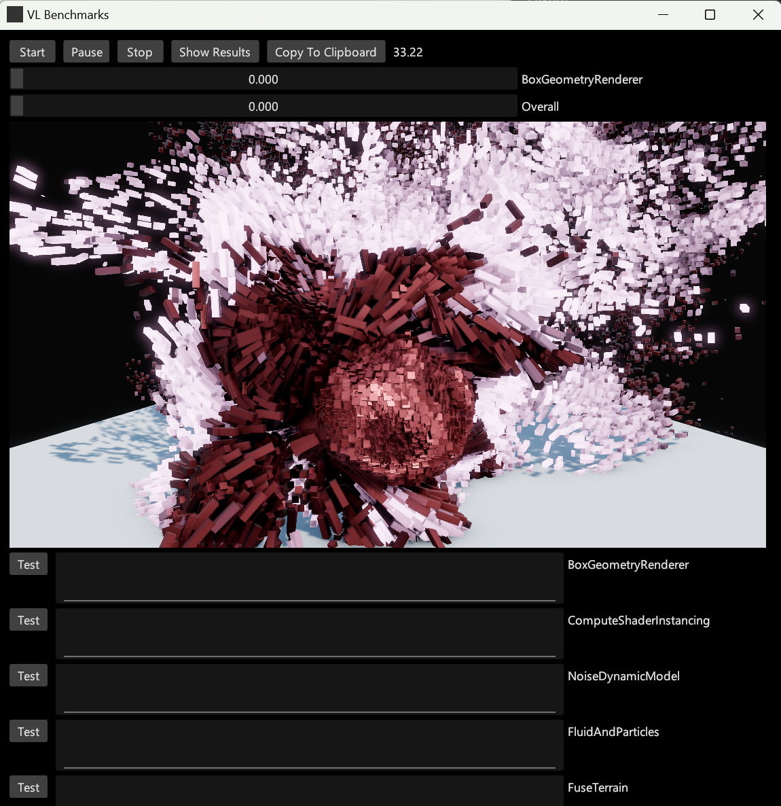

# VL.Benchmarks

**VL.Benchmarks** is a performance testing suite designed for use with [vvvv](http://visualprogramming.net), a visual live-programming environment built on .NET. This tool allows you to run various benchmarks defined by XML files and records their frames per second (FPS). The results are output to CSV files for further data analysis.

## Features

- **Predefined Benchmarks:** Run benchmarks that are ready to go.
- **Custom Benchmarks:** Set up your own benchmarks tailored to your specific performance testing needs.
- **Results Analysis:** Automatically save benchmark results in a CSV format for easy analysis.

## Getting Started

### Prerequisites

To develop your own benchmarks:
Ensure you have vvvv installed. You can download it from [visualprogramming.net](http://visualprogramming.net).

### Installation

- Download the executable from the [Releases](https://github.com/tebjan/VL.Benchmarks/releases) page of this repository.

### Running Benchmarks

#### Predefined Benchmarks

To run predefined benchmarks:
1. Download the executable from the release page.
2. Execute the benchmarks and check the CSV output for results.

Note on Performance:

The current version of VL.Benchmarks is optimized for high-end machines, and mid-range machines may experience very low FPS with the default settings. You can adjust some settings in the BenchmarkList.xml to better suit your hardware.

#### Custom Benchmarks

To create and run custom benchmarks:
- Please refer to the example patches included in this repository for guidance on setting up your benchmarks.
- If you need further assistance, ask specific questions in the [vvvv forum](https://discourse.vvvv.org/c/vvvv-gamma/28).

## Contributing

Any contributions you make are **greatly appreciated**.

- **Report Bugs**: Post bug reports in the issues here or in the [vvvv forum](https://discourse.vvvv.org/c/vvvv-gamma/28).
- **Feature Requests and Discussions**: Use the same forums for discussions and feature requests.
- **Pull Requests**: You are welcome to submit pull requests.

For direct inquiries about custom development, please [contact me](https://github.com/tebjan).

## Sponsoring

Development of this library was generously sponsored by [Refik Anadol Studio](https://refikanadolstudio.com).

## License

This project is licensed under the [MIT License](LICENSE.md) - see the LICENSE file for details.
